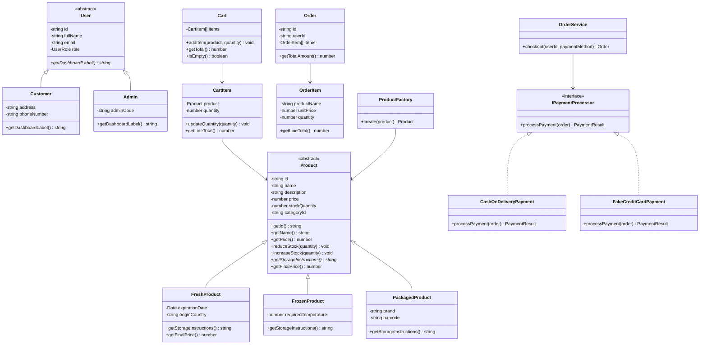

# Bakkal Amca Online Market Alışveriş Sistemi

Bakkal Amca, Nesne Yönelimli Programlama 2 dersi için geliştirilmiş prototip bir online market alışveriş sistemidir. Prisma ve SQLite tabanlı veritabanı kullanır. Next.js uygulaması hem API backend'i hem de frontend olarak çalışır.

Proje; temiz backend mimarisine, görünür OOP prensiplerine, rol bazlı müşteri/admin davranışına, sepet ve ödeme mantığına ve basit kullanılabilir bir arayüze odaklanır.

Projenın odak noktası OOP prensiplerine dayalı temiz bir backend mimarisidir. Bunun yanı sıra inceleme ve sunum kolaylığı açısından basit bir frontend'e sahiptir.

## Tech Stack

- Next.js App Router
- TypeScript
- Prisma ORM
- SQLite
- React
- CSS
- bcryptjs
- jose
- Zod

## Özellikler

- Müşteri kaydı ve girişi
- HTTP-only cookie ile JWT kimlik doğrulama
- Müşteri ve admin rolleri
- Ürün listesi, arama, detay sayfaları ve kategori filtreleme
- Ürün tipi desteği: taze, dondurulmuş, paketli
- Sepete ekleme, güncelleme, silme, temizleme ve toplam hesaplama
- Sahte kredi kartı veya kapıda ödeme ile sipariş tamamlama
- Müşteriler için sipariş geçmişi
- Sayaçlar, düşük stoklu ürünler ve son siparişlerle admin paneli
- Admin ürün oluşturma, düzenleme, soft delete ve stok güncelleme
- Admin kategori oluşturma, düzenleme ve silme
- Admin sipariş listesi ve durum güncelleme
- Özel API hata sınıfları ve merkezi API hata yönetimi
- Zod istek doğrulaması
- Kalıtım, interface, soyutlama, kapsülleme ve çok biçimlilik içeren OOP domain katmanı

## Test hesapları

```txt
Admin
E-posta: admin@grocery.com
Şifre: admin123

Müşteri
E-posta: customer@grocery.com
Şifre: customer123
```

## Kurulum

1. Gereksinimlerini yükleyin.

```powershell
npm install
```

2. .env dosyasını oluşturun.

```powershell
Copy-Item .env.example .env
```

3. Prisma Client'i oluşturun.

```powershell
npx prisma generate
```

4. SQLite veritabanını oluşturun.

```powershell
npx prisma db execute --file prisma/migrations/20260626195400_init/migration.sql --schema prisma/schema.prisma
```

5. Varsayılan verileri ekleyin.

```powershell
npx prisma db seed
```

6. Geliştirme sunucusunu başlatın.

```powershell
npm run dev
```

`http://localhost:3000` adresini açın.

## Scriptler

```txt
npm run dev              Yerel geliştirme sunucusunu başlatır
npm run build            Production uygulamasını derler
npm run start            Derlemeden sonra production uygulamasını başlatır
npm run lint             ESLint çalıştırır
npm run prisma:generate  Prisma Client oluşturur
npm run prisma:seed      Veritabanı seed işlemini çalıştırır
```

## Sayfalar

```txt
/                    Ana sayfa
/login               Giriş
/register            Kayıt
/products            Ürün listeleme
/products/[id]       Ürün detayı
/cart                Alışveriş sepeti
/checkout            Ödeme
/orders              Müşteri sipariş geçmişi
/admin               Admin paneli
/admin/products      Admin ürün yönetimi
/admin/categories    Admin kategori yönetimi
/admin/orders        Admin sipariş yönetimi
```

## API Endpointleri

### Kimlik Doğrulama

| Method | Endpoint | Erişim | Açıklama |
|---|---|---|---|
| POST | `/api/auth/register` | Public | Müşteri kaydı |
| POST | `/api/auth/login` | Public | Giriş yapar ve auth cookie ayarlar |
| POST | `/api/auth/logout` | Authenticated | Auth cookie temizler |
| GET | `/api/auth/me` | Authenticated | Mevcut kullanıcıyı getirir |

### Ürünler ve Kategoriler

| Method | Endpoint | Erişim | Açıklama |
|---|---|---|---|
| GET | `/api/products` | Public | Ürünleri listeler/arar/filtreler |
| GET | `/api/products/[id]` | Public | Ürün detayı |
| GET | `/api/categories` | Public | Kategorileri listeler |

### Sepet

| Method | Endpoint | Erişim | Açıklama |
|---|---|---|---|
| GET | `/api/cart` | Customer | Mevcut sepeti getirir |
| DELETE | `/api/cart` | Customer | Sepeti temizler |
| POST | `/api/cart/items` | Customer | Ürün ekler |
| PUT | `/api/cart/items/[id]` | Customer | Ürün miktarını günceller |
| DELETE | `/api/cart/items/[id]` | Customer | Ürünü sepetten siler |

### Siparişler

| Method | Endpoint | Erişim | Açıklama |
|---|---|---|---|
| POST | `/api/orders/checkout` | Customer | Sepetten sipariş oluşturur |
| GET | `/api/orders/my-orders` | Customer | Mevcut kullanıcının siparişleri |
| GET | `/api/orders/[id]` | Customer/Admin | Sipariş detayı |

### Admin

| Method | Endpoint | Erişim | Açıklama |
|---|---|---|---|
| GET | `/api/admin/dashboard` | Admin | Panel istatistikleri |
| GET | `/api/admin/products` | Admin | Ürünleri listeler |
| POST | `/api/admin/products` | Admin | Ürün oluşturur |
| PUT | `/api/admin/products/[id]` | Admin | Ürünü günceller |
| PATCH | `/api/admin/products/[id]` | Admin | Stok günceller |
| DELETE | `/api/admin/products/[id]` | Admin | Ürünü soft delete ile siler |
| GET | `/api/admin/categories` | Admin | Kategorileri listeler |
| POST | `/api/admin/categories` | Admin | Kategori oluşturur |
| PUT | `/api/admin/categories/[id]` | Admin | Kategoriyi günceller |
| DELETE | `/api/admin/categories/[id]` | Admin | Kategoriyi siler |
| GET | `/api/admin/orders` | Admin | Tüm siparişleri listeler |
| GET | `/api/admin/orders/[id]` | Admin | Sipariş detayı |
| PATCH | `/api/admin/orders/[id]` | Admin | Sipariş durumunu günceller |

## Veritabanı Özeti

Prisma şeması şu ana modelleri içerir:

- `User`: hashlenmiş şifrelere sahip müşteri/admin hesapları
- `Category`: ürün gruplama
- `Product`: tipe özel alanları olan market ürünleri
- `Cart`: kullanıcı başına bir sepet
- `CartItem`: sepetteki ürün ve miktar
- `Order`: durum ve ödeme alanlarıyla sipariş sonucu
- `OrderItem`: ad, birim fiyat ve miktar içeren satın alınmış ürün anlık görüntüsü

Önemli enumlar:

- `UserRole`: `ADMIN`, `CUSTOMER`
- `ProductType`: `FRESH`, `FROZEN`, `PACKAGED`
- `OrderStatus`: `PENDING`, `PREPARING`, `SHIPPED`, `DELIVERED`, `CANCELLED`
- `PaymentStatus`: `PENDING`, `PAID`, `FAILED`, `CASH_ON_DELIVERY`
- `PaymentMethod`: `CASH_ON_DELIVERY`, `FAKE_CREDIT_CARD`

## Kullanılan OOP Prensipleri

### Kapsülleme

Domain sınıfları iç durumu private tutar ve kontrollü public metotlar sunar. Örneğin `Product` stoğu `reduceStock()` ve `increaseStock()` ile değiştirilir; `Cart` ögeleri ise `addItem()` ile eklenir.

### Kalıtım

Projede `FreshProduct`, `FrozenProduct` ve `PackagedProduct` alt sınıflarına sahip soyut bir `Product` sınıfı kullanılır. Ayrıca `Customer` ve `Admin` alt sınıflarına sahip soyut bir `User` sınıfı bulunur.

### Interface ve Soyutlama

`IPaymentProcessor` ortak bir ödeme soyutlaması tanımlar. `CashOnDeliveryPayment` ve `FakeCreditCardPayment` bu interface'i uygular.

### Çok Biçimlilik

`OrderService`, ödeme yöntemine göre bir `IPaymentProcessor` implementasyonu seçer ve checkout işlemini somut ödeme sınıflarına bağlanmak yerine interface referansı üzerinden çalıştırır.

### Tasarım Bütünlüğü

Uygulama route handler'ları, servisleri, repository'leri, domain modellerini, validator'ları, auth yardımcılarını ve exception'ları ayırır. API route dosyaları controller gibi davranır ve iş mantığını servislere devreder.

## UML Sınıf Diyagramı

