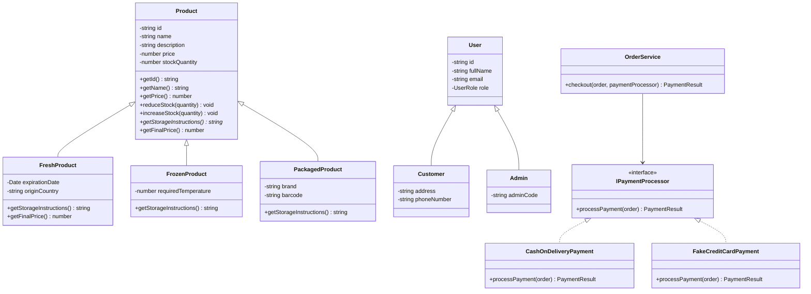

# Online Grocery Shopping Management System — Project Requirements & Development Guideline

## 1. Project Overview

This project is an **Online Grocery Shopping Management System** built for a university **Object Oriented Programming 2** course.

The main goal is to create a **robust API backend service** while also including simple frontend pages to demonstrate the system visually.

The system will include:

1. **Backend API**
   - Data processing
   - Database management
   - User authentication
   - Product/category/order/cart logic
   - Admin/customer role separation

2. **Admin Panel**
   - Manage product listings
   - Manage categories
   - View and update orders
   - View basic dashboard statistics

3. **User Application**
   - Browse products and categories
   - Search products
   - Add products to shopping cart
   - Update/remove cart items
   - Place fake purchases
   - View order history

This is a **prototype-level academic project**, not a production e-commerce application. Real payment systems, real shipment tracking, and enterprise-level security are not required.

---

## 2. Course Assessment Mapping

The project must clearly satisfy the following assessment form.

### A. Core OOP Principles — 50 Points

| Criterion | Required Evidence in Project |
|---|---|
| Encapsulation | Private fields, controlled methods, constructors, getters where needed |
| Inheritance | Meaningful parent-child class relationship |
| Interface and Abstraction | At least one interface and abstract class |
| Polymorphism | Use upper-type/interface references and dynamic behavior |
| Design Integrity | Clean class structure, low duplication, good separation of responsibilities |

### B. Technical Implementation — 30 Points

| Criterion | Required Evidence in Project |
|---|---|
| Requirements Coverage | Auth, products, categories, cart, orders, admin panel, user frontend |
| Code Organization and Readability | Meaningful names, comments where useful, clean folder structure |
| Exception Handling | Custom errors and centralized API error handling |

### C. Extra Features and Professionalism — 20 Points

| Criterion | Required Evidence in Project |
|---|---|
| Creativity and Extra Features | Low-stock warning, fake payment, product types, admin dashboard |
| Documentation | README, UML diagram, API documentation, setup guide, screenshots |

---

## 3. Chosen Technology Stack

### Main Stack

- **Next.js**
- **TypeScript**
- **Prisma ORM**
- **SQLite**
- **Tailwind CSS**
- **bcryptjs**
- **jose** or **jsonwebtoken**
- **Zod**

### Why This Stack?

Next.js allows the project to contain both:

- Backend API endpoints
- Frontend pages

inside one project.

TypeScript allows us to design a clear OOP-style architecture using:

- Classes
- Abstract classes
- Interfaces
- Inheritance
- Polymorphism
- Encapsulation

Prisma and SQLite make the database easy to manage and easy to submit with the project.

---

## 4. High-Level System Architecture

The project should use the following architecture:

```txt
Next.js Application
│
├── Frontend Pages
│   ├── Public user shopping pages
│   └── Admin panel pages
│
├── API Routes
│   ├── Auth endpoints
│   ├── Product endpoints
│   ├── Category endpoints
│   ├── Cart endpoints
│   ├── Order endpoints
│   └── Admin endpoints
│
├── Service Layer
│   ├── AuthService
│   ├── ProductService
│   ├── CategoryService
│   ├── CartService
│   └── OrderService
│
├── Repository Layer
│   ├── UserRepository
│   ├── ProductRepository
│   ├── CategoryRepository
│   ├── CartRepository
│   └── OrderRepository
│
├── Domain Layer
│   ├── Models
│   ├── Interfaces
│   ├── Payments
│   └── Factories
│
└── Database Layer
    └── Prisma + SQLite
```

Important rule:

> API route files should act like controllers. Business logic should not be written directly inside route handlers.

---

## 5. Recommended Folder Structure

```txt
online-grocery-system
│
├── prisma
│   ├── schema.prisma
│   └── seed.ts
│
├── src
│   ├── app
│   │   ├── page.tsx
│   │   │
│   │   ├── products
│   │   │   ├── page.tsx
│   │   │   └── [id]
│   │   │       └── page.tsx
│   │   │
│   │   ├── cart
│   │   │   └── page.tsx
│   │   │
│   │   ├── checkout
│   │   │   └── page.tsx
│   │   │
│   │   ├── orders
│   │   │   └── page.tsx
│   │   │
│   │   ├── login
│   │   │   └── page.tsx
│   │   │
│   │   ├── register
│   │   │   └── page.tsx
│   │   │
│   │   ├── admin
│   │   │   ├── page.tsx
│   │   │   ├── products
│   │   │   │   └── page.tsx
│   │   │   ├── categories
│   │   │   │   └── page.tsx
│   │   │   └── orders
│   │   │       └── page.tsx
│   │   │
│   │   └── api
│   │       ├── auth
│   │       │   ├── login
│   │       │   │   └── route.ts
│   │       │   ├── register
│   │       │   │   └── route.ts
│   │       │   └── me
│   │       │       └── route.ts
│   │       │
│   │       ├── products
│   │       │   ├── route.ts
│   │       │   └── [id]
│   │       │       └── route.ts
│   │       │
│   │       ├── categories
│   │       │   └── route.ts
│   │       │
│   │       ├── cart
│   │       │   ├── route.ts
│   │       │   ├── items
│   │       │   │   └── route.ts
│   │       │   └── items
│   │       │       └── [id]
│   │       │           └── route.ts
│   │       │
│   │       ├── orders
│   │       │   ├── checkout
│   │       │   │   └── route.ts
│   │       │   ├── my-orders
│   │       │   │   └── route.ts
│   │       │   └── [id]
│   │       │       └── route.ts
│   │       │
│   │       └── admin
│   │           ├── products
│   │           │   ├── route.ts
│   │           │   └── [id]
│   │           │       └── route.ts
│   │           ├── categories
│   │           │   ├── route.ts
│   │           │   └── [id]
│   │           │       └── route.ts
│   │           └── orders
│   │               ├── route.ts
│   │               └── [id]
│   │                   └── route.ts
│   │
│   ├── domain
│   │   ├── models
│   │   │   ├── Product.ts
│   │   │   ├── FreshProduct.ts
│   │   │   ├── FrozenProduct.ts
│   │   │   ├── PackagedProduct.ts
│   │   │   ├── User.ts
│   │   │   ├── Customer.ts
│   │   │   ├── Admin.ts
│   │   │   ├── Cart.ts
│   │   │   ├── CartItem.ts
│   │   │   ├── Order.ts
│   │   │   └── OrderItem.ts
│   │   │
│   │   ├── interfaces
│   │   │   ├── IPaymentProcessor.ts
│   │   │   ├── IDiscountable.ts
│   │   │   └── IStockManageable.ts
│   │   │
│   │   ├── payments
│   │   │   ├── CashOnDeliveryPayment.ts
│   │   │   └── FakeCreditCardPayment.ts
│   │   │
│   │   └── factories
│   │       └── ProductFactory.ts
│   │
│   ├── services
│   │   ├── AuthService.ts
│   │   ├── ProductService.ts
│   │   ├── CategoryService.ts
│   │   ├── CartService.ts
│   │   └── OrderService.ts
│   │
│   ├── repositories
│   │   ├── UserRepository.ts
│   │   ├── ProductRepository.ts
│   │   ├── CategoryRepository.ts
│   │   ├── CartRepository.ts
│   │   └── OrderRepository.ts
│   │
│   ├── exceptions
│   │   ├── AppError.ts
│   │   ├── NotFoundError.ts
│   │   ├── ValidationError.ts
│   │   ├── UnauthorizedError.ts
│   │   ├── ForbiddenError.ts
│   │   ├── InsufficientStockError.ts
│   │   └── handleApiError.ts
│   │
│   ├── lib
│   │   ├── prisma.ts
│   │   ├── auth.ts
│   │   └── validators.ts
│   │
│   └── types
│       ├── enums.ts
│       └── dto.ts
│
├── public
│   └── images
│
├── README.md
├── package.json
└── .env
```

---

## 6. Functional Requirements

### 6.1 Authentication Requirements

The system must support:

- User registration
- User login
- Password hashing
- JWT/session-based authentication
- Role-based authorization
- Customer role
- Admin role

Roles:

```ts
export enum UserRole {
  ADMIN = "ADMIN",
  CUSTOMER = "CUSTOMER",
}
```

Default users should be created in the seed file:

```txt
Admin:
email: admin@grocery.com
password: admin123

Customer:
email: customer@grocery.com
password: customer123
```

---

### 6.2 Product Requirements

The system must support:

- List all products
- View product details
- Search products by name
- Filter products by category
- Admin create product
- Admin update product
- Admin delete product
- Admin update stock
- Product image URL support
- Product type support

Product types:

```ts
export enum ProductType {
  FRESH = "FRESH",
  FROZEN = "FROZEN",
  PACKAGED = "PACKAGED",
}
```

Product examples:

- Milk
- Egg
- Bread
- Apple
- Banana
- Frozen Pizza
- Ice Cream
- Rice
- Pasta
- Olive Oil

---

### 6.3 Category Requirements

The system must support:

- List categories
- Admin create category
- Admin update category
- Admin delete category

Example categories:

- Fruits & Vegetables
- Dairy
- Bakery
- Frozen Food
- Beverages
- Snacks
- Pantry

---

### 6.4 Cart Requirements

Customers must be able to:

- View their cart
- Add product to cart
- Update cart item quantity
- Remove item from cart
- Clear cart
- See cart total

Rules:

- Quantity must be greater than zero.
- User cannot add more items than available stock.
- Deleted/unavailable products should not break the cart.

---

### 6.5 Order Requirements

Customers must be able to:

- Checkout with fake payment
- Select payment method
- Create order from cart
- View order history
- View order details

Checkout rules:

- Cart cannot be empty.
- Product stock must be checked before creating order.
- Product stock must decrease after successful checkout.
- Cart must be cleared after order creation.
- Order items must store product name and unit price at the time of purchase.

Order statuses:

```ts
export enum OrderStatus {
  PENDING = "PENDING",
  PREPARING = "PREPARING",
  SHIPPED = "SHIPPED",
  DELIVERED = "DELIVERED",
  CANCELLED = "CANCELLED",
}
```

Payment statuses:

```ts
export enum PaymentStatus {
  PENDING = "PENDING",
  PAID = "PAID",
  FAILED = "FAILED",
  CASH_ON_DELIVERY = "CASH_ON_DELIVERY",
}
```

Payment methods:

```ts
export enum PaymentMethod {
  CASH_ON_DELIVERY = "CASH_ON_DELIVERY",
  FAKE_CREDIT_CARD = "FAKE_CREDIT_CARD",
}
```

---

### 6.6 Admin Requirements

Admins must be able to:

- Access admin dashboard
- View total product count
- View total category count
- View total order count
- View low-stock products
- Manage products
- Manage categories
- View all orders
- Update order status

Admin-only API endpoints must reject customer users.

---

## 7. OOP Requirements

The project must intentionally demonstrate OOP principles.

### 7.1 Encapsulation

Domain classes must keep internal state private where possible.

Example expectations:

- `Product` stock should not be changed directly.
- Stock should be changed through methods such as:
  - `reduceStock(quantity)`
  - `increaseStock(quantity)`
- Cart items should be added through a method like:
  - `cart.addItem(product, quantity)`
- Order total should be calculated through class methods.

Example:

```ts
export abstract class Product {
  private readonly id: string;
  private name: string;
  private description: string;
  private price: number;
  private stockQuantity: number;
  private categoryId: string;

  protected constructor(
    id: string,
    name: string,
    description: string,
    price: number,
    stockQuantity: number,
    categoryId: string
  ) {
    if (price <= 0) {
      throw new Error("Product price must be greater than zero.");
    }

    if (stockQuantity < 0) {
      throw new Error("Stock quantity cannot be negative.");
    }

    this.id = id;
    this.name = name;
    this.description = description;
    this.price = price;
    this.stockQuantity = stockQuantity;
    this.categoryId = categoryId;
  }

  public getId(): string {
    return this.id;
  }

  public getName(): string {
    return this.name;
  }

  public getPrice(): number {
    return this.price;
  }

  public getStockQuantity(): number {
    return this.stockQuantity;
  }

  public reduceStock(quantity: number): void {
    if (quantity <= 0) {
      throw new Error("Quantity must be greater than zero.");
    }

    if (quantity > this.stockQuantity) {
      throw new Error("Not enough stock available.");
    }

    this.stockQuantity -= quantity;
  }

  public increaseStock(quantity: number): void {
    if (quantity <= 0) {
      throw new Error("Quantity must be greater than zero.");
    }

    this.stockQuantity += quantity;
  }

  public abstract getStorageInstructions(): string;

  public getFinalPrice(): number {
    return this.price;
  }
}
```

---

### 7.2 Inheritance

The system must include a meaningful inheritance hierarchy.

Required product hierarchy:

```txt
Product
├── FreshProduct
├── FrozenProduct
└── PackagedProduct
```

Optional user hierarchy:

```txt
User
├── Customer
└── Admin
```

Product child classes must override product-specific behavior.

Example:

```ts
export class FreshProduct extends Product {
  private expirationDate: Date;
  private originCountry: string;

  public getStorageInstructions(): string {
    return "Keep refrigerated and consume before the expiration date.";
  }

  public override getFinalPrice(): number {
    // Fresh products close to expiration may receive discount.
    return this.getPrice();
  }
}
```

---

### 7.3 Interface and Abstraction

The project must include at least one interface.

Required interface:

```ts
export interface IPaymentProcessor {
  processPayment(order: Order): PaymentResult;
}
```

Required implementations:

```txt
IPaymentProcessor
├── CashOnDeliveryPayment
└── FakeCreditCardPayment
```

Optional interfaces:

```ts
export interface IDiscountable {
  getFinalPrice(): number;
}
```

```ts
export interface IStockManageable {
  reduceStock(quantity: number): void;
  increaseStock(quantity: number): void;
}
```

---

### 7.4 Polymorphism

The checkout system must use polymorphism.

`OrderService` should depend on the interface, not concrete payment classes.

Example:

```ts
export class OrderService {
  public checkout(order: Order, paymentProcessor: IPaymentProcessor): PaymentResult {
    const result = paymentProcessor.processPayment(order);

    if (!result.success) {
      throw new Error("Payment failed.");
    }

    order.markAsPaid(result.paymentStatus);

    return result;
  }
}
```

Valid payment processors:

```ts
const paymentProcessor: IPaymentProcessor = new CashOnDeliveryPayment();
```

or:

```ts
const paymentProcessor: IPaymentProcessor = new FakeCreditCardPayment();
```

This proves polymorphism because the same checkout logic works with different payment implementations.

Another polymorphism example:

```ts
const products: Product[] = [
  new FreshProduct(...),
  new FrozenProduct(...),
  new PackagedProduct(...),
];

for (const product of products) {
  console.log(product.getStorageInstructions());
  console.log(product.getFinalPrice());
}
```

---

### 7.5 Design Integrity

The project should be separated into:

- Route handlers
- Services
- Repositories
- Domain models
- Interfaces
- DTOs
- Exceptions
- Validators

Avoid:

- Giant route files
- Repeated database logic
- Business logic inside React components
- Business logic directly inside API handlers
- Unclear class names
- Unused inheritance/interfaces just for appearance

---

## 8. Database Requirements

Use Prisma with SQLite.

### 8.1 Prisma Schema

```prisma
datasource db {
  provider = "sqlite"
  url      = "file:./dev.db"
}

generator client {
  provider = "prisma-client-js"
}

enum UserRole {
  ADMIN
  CUSTOMER
}

enum ProductType {
  FRESH
  FROZEN
  PACKAGED
}

enum OrderStatus {
  PENDING
  PREPARING
  SHIPPED
  DELIVERED
  CANCELLED
}

enum PaymentStatus {
  PENDING
  PAID
  FAILED
  CASH_ON_DELIVERY
}

model User {
  id           String   @id @default(cuid())
  fullName     String
  email        String   @unique
  passwordHash String
  role         UserRole
  address      String?
  phoneNumber  String?

  cart         Cart?
  orders       Order[]

  createdAt    DateTime @default(now())
  updatedAt    DateTime @updatedAt
}

model Category {
  id          String    @id @default(cuid())
  name        String
  description String?

  products    Product[]
}

model Product {
  id                  String      @id @default(cuid())
  name                String
  description         String
  price               Float
  stockQuantity       Int
  imageUrl            String?
  productType         ProductType

  categoryId          String
  category            Category    @relation(fields: [categoryId], references: [id])

  expirationDate      DateTime?
  originCountry       String?
  requiredTemperature Int?
  brand               String?
  barcode             String?

  cartItems           CartItem[]

  createdAt           DateTime    @default(now())
  updatedAt           DateTime    @updatedAt
}

model Cart {
  id        String     @id @default(cuid())

  userId    String     @unique
  user      User       @relation(fields: [userId], references: [id])

  items     CartItem[]
}

model CartItem {
  id        String   @id @default(cuid())
  quantity  Int

  cartId    String
  cart      Cart     @relation(fields: [cartId], references: [id])

  productId String
  product   Product  @relation(fields: [productId], references: [id])
}

model Order {
  id            String        @id @default(cuid())

  userId        String
  user          User          @relation(fields: [userId], references: [id])

  totalAmount   Float
  orderStatus   OrderStatus
  paymentStatus PaymentStatus

  items         OrderItem[]

  createdAt     DateTime      @default(now())
}

model OrderItem {
  id          String  @id @default(cuid())

  orderId     String
  order       Order   @relation(fields: [orderId], references: [id])

  productName String
  unitPrice   Float
  quantity    Int
  subtotal    Float
}
```

### 8.2 Important Database Notes

Prisma models are database persistence models.

The OOP domain classes are separate TypeScript classes.

Use a factory to convert database product objects into domain class objects:

```txt
Prisma Product row
        ↓
ProductFactory
        ↓
FreshProduct / FrozenProduct / PackagedProduct
        ↓
Business logic
```

---

## 9. Domain Models

### Required Domain Models

```txt
Product
FreshProduct
FrozenProduct
PackagedProduct
User
Customer
Admin
Cart
CartItem
Order
OrderItem
```

### ProductFactory

A `ProductFactory` must create the correct product class depending on `productType`.

```ts
export class ProductFactory {
  public static createFromDatabase(product: any): Product {
    switch (product.productType) {
      case "FRESH":
        return new FreshProduct(
          product.id,
          product.name,
          product.description,
          product.price,
          product.stockQuantity,
          product.categoryId,
          product.expirationDate,
          product.originCountry ?? "Unknown"
        );

      case "FROZEN":
        return new FrozenProduct(
          product.id,
          product.name,
          product.description,
          product.price,
          product.stockQuantity,
          product.categoryId,
          product.requiredTemperature ?? -18
        );

      case "PACKAGED":
        return new PackagedProduct(
          product.id,
          product.name,
          product.description,
          product.price,
          product.stockQuantity,
          product.categoryId,
          product.brand ?? "Unknown",
          product.barcode ?? "N/A"
        );

      default:
        throw new Error("Invalid product type.");
    }
  }
}
```

---

## 10. Service Requirements

### 10.1 AuthService

Responsible for:

- Register user
- Login user
- Hash password
- Compare password
- Create JWT
- Validate current user
- Reject duplicate email

### 10.2 ProductService

Responsible for:

- Get all products
- Get product by ID
- Search products
- Filter products by category
- Create product
- Update product
- Delete product
- Update stock
- Convert database product to domain object when OOP behavior is needed

### 10.3 CategoryService

Responsible for:

- List categories
- Create category
- Update category
- Delete category
- Prevent deleting category if products exist, or handle it safely

### 10.4 CartService

Responsible for:

- Get user cart
- Create cart if missing
- Add item to cart
- Update cart item quantity
- Remove cart item
- Clear cart
- Calculate total
- Validate stock

### 10.5 OrderService

Responsible for:

- Checkout
- Select payment processor
- Validate cart
- Validate stock
- Create order
- Create order items
- Reduce product stock
- Clear cart
- Get user orders
- Get order details
- Admin update order status

---

## 11. Repository Requirements

Repositories should contain database access logic.

Required repositories:

```txt
UserRepository
ProductRepository
CategoryRepository
CartRepository
OrderRepository
```

Example responsibilities:

### ProductRepository

- `findAll()`
- `findById(id)`
- `findByCategory(categoryId)`
- `search(keyword)`
- `create(data)`
- `update(id, data)`
- `delete(id)`
- `updateStock(id, stockQuantity)`

### CartRepository

- `findByUserId(userId)`
- `createForUser(userId)`
- `addItem(cartId, productId, quantity)`
- `updateItemQuantity(itemId, quantity)`
- `removeItem(itemId)`
- `clearCart(cartId)`

---

## 12. API Requirements

### 12.1 Auth API

| Method | Endpoint | Description | Access |
|---|---|---|---|
| POST | `/api/auth/register` | Register customer | Public |
| POST | `/api/auth/login` | Login user/admin | Public |
| GET | `/api/auth/me` | Get current user | Authenticated |

### 12.2 Product API

| Method | Endpoint | Description | Access |
|---|---|---|---|
| GET | `/api/products` | List/search/filter products | Public |
| GET | `/api/products/[id]` | Get product details | Public |

Query examples:

```txt
/api/products
/api/products?search=milk
/api/products?categoryId=abc123
/api/products?search=milk&categoryId=abc123
```

### 12.3 Category API

| Method | Endpoint | Description | Access |
|---|---|---|---|
| GET | `/api/categories` | List categories | Public |

### 12.4 Cart API

| Method | Endpoint | Description | Access |
|---|---|---|---|
| GET | `/api/cart` | Get current user's cart | Customer |
| POST | `/api/cart/items` | Add item to cart | Customer |
| PUT | `/api/cart/items/[id]` | Update item quantity | Customer |
| DELETE | `/api/cart/items/[id]` | Remove cart item | Customer |
| DELETE | `/api/cart` | Clear cart | Customer |

### 12.5 Order API

| Method | Endpoint | Description | Access |
|---|---|---|---|
| POST | `/api/orders/checkout` | Create order from cart | Customer |
| GET | `/api/orders/my-orders` | View current user's orders | Customer |
| GET | `/api/orders/[id]` | View order detail | Customer/Admin |

### 12.6 Admin API

| Method | Endpoint | Description | Access |
|---|---|---|---|
| POST | `/api/admin/products` | Create product | Admin |
| PUT | `/api/admin/products/[id]` | Update product | Admin |
| DELETE | `/api/admin/products/[id]` | Delete product | Admin |
| PATCH | `/api/admin/products/[id]` | Update product stock | Admin |
| POST | `/api/admin/categories` | Create category | Admin |
| PUT | `/api/admin/categories/[id]` | Update category | Admin |
| DELETE | `/api/admin/categories/[id]` | Delete category | Admin |
| GET | `/api/admin/orders` | View all orders | Admin |
| PATCH | `/api/admin/orders/[id]` | Update order status | Admin |

---

## 13. Frontend Requirements

The frontend can be simple, but it should demonstrate the system clearly.

### 13.1 User Frontend Pages

Required pages:

```txt
/
 /products
 /products/[id]
 /cart
 /checkout
 /orders
 /login
 /register
```

#### Home Page

Should include:

- Project name
- Short description
- Featured categories
- Link to products page
- Login/register buttons or current user info

#### Products Page

Should include:

- Product grid
- Product name
- Product price
- Product image
- Product category
- Product type
- Search input
- Category filter
- Add to cart button

#### Product Detail Page

Should include:

- Product image
- Product name
- Description
- Price
- Stock
- Category
- Product type
- Storage instructions if available
- Add to cart button

#### Cart Page

Should include:

- Cart items
- Quantity update
- Remove item
- Cart total
- Checkout button

#### Checkout Page

Should include:

- Order summary
- Payment method selection
- Fake checkout button

#### Orders Page

Should include:

- Previous orders
- Order status
- Payment status
- Total amount
- Order date

---

### 13.2 Admin Frontend Pages

Required pages:

```txt
/admin
/admin/products
/admin/categories
/admin/orders
```

#### Admin Dashboard

Should include:

- Total products
- Total categories
- Total orders
- Low-stock products
- Recent orders

#### Admin Products Page

Should include:

- Product list
- Create product form
- Edit product action
- Delete product action
- Stock update action

#### Admin Categories Page

Should include:

- Category list
- Create category form
- Edit category action
- Delete category action

#### Admin Orders Page

Should include:

- List all orders
- Customer info
- Total amount
- Order status
- Payment status
- Update order status action

---

## 14. Exception Handling Requirements

The project must include custom error classes and centralized API error handling.

Required errors:

```txt
AppError
NotFoundError
ValidationError
UnauthorizedError
ForbiddenError
InsufficientStockError
```

Example:

```ts
export class AppError extends Error {
  public readonly statusCode: number;

  public constructor(message: string, statusCode: number) {
    super(message);
    this.statusCode = statusCode;
  }
}
```

```ts
export class NotFoundError extends AppError {
  public constructor(message = "Resource not found.") {
    super(message, 404);
  }
}
```

```ts
export function handleApiError(error: unknown): Response {
  if (error instanceof AppError) {
    return Response.json(
      { error: error.message },
      { status: error.statusCode }
    );
  }

  console.error(error);

  return Response.json(
    { error: "An unexpected error occurred." },
    { status: 500 }
  );
}
```

All API routes should use `try/catch`.

Example:

```ts
export async function GET() {
  try {
    const service = new ProductService();
    const products = await service.getAllProducts();

    return Response.json(products);
  } catch (error) {
    return handleApiError(error);
  }
}
```

---

## 15. Validation Requirements

Use Zod for request validation.

Required validations:

### Register

- Full name required
- Email required and valid
- Password required
- Password minimum length
- Address optional
- Phone number optional

### Login

- Email required
- Password required

### Product Create/Update

- Name required
- Description required
- Price greater than zero
- Stock quantity cannot be negative
- Product type required
- Category required
- Type-specific fields validated where applicable

### Cart

- Product ID required
- Quantity greater than zero

### Checkout

- Payment method required

---

## 16. Security Requirements

Prototype-level security is enough.

Required:

- Hash passwords using `bcryptjs`
- Do not store plain text passwords
- Use JWT or session cookie
- Protect admin API routes
- Protect customer-only cart/order routes
- Validate all request bodies
- Do not expose `passwordHash` in frontend responses

Not required:

- Real email verification
- Password reset
- OAuth login
- Real payment security
- Production-grade deployment security

---

## 17. UI/UX Requirements

The UI does not need to be complex.

Use Tailwind CSS.

General style:

- Clean layout
- Simple navigation
- Product cards
- Admin table views
- Clear buttons
- Basic success/error messages
- Responsive enough for laptop screen

Recommended navigation:

### User Navigation

```txt
Home
Products
Cart
Orders
Login/Register or Logout
```

### Admin Navigation

```txt
Dashboard
Products
Categories
Orders
Logout
```

---

## 18. Development Steps

### Phase 1 — Project Setup

1. Create Next.js TypeScript project.
2. Install dependencies:
   - Prisma
   - Prisma Client
   - bcryptjs
   - jose or jsonwebtoken
   - zod
   - Tailwind CSS
3. Configure project aliases such as `@/`.
4. Create initial folder structure.
5. Initialize Prisma.
6. Configure SQLite database.
7. Add `.env` file.

Suggested commands:

```bash
npx create-next-app@latest online-grocery-system --typescript
cd online-grocery-system

npm install prisma @prisma/client
npm install bcryptjs zod jose
npm install -D tsx

npx prisma init --datasource-provider sqlite
```

---

### Phase 2 — Database Design

1. Create Prisma schema.
2. Add enums.
3. Add models:
   - User
   - Category
   - Product
   - Cart
   - CartItem
   - Order
   - OrderItem
4. Run migration.
5. Create seed file.
6. Seed:
   - Admin user
   - Customer user
   - Categories
   - Sample products

Suggested commands:

```bash
npx prisma migrate dev --name init
npx prisma db seed
```

---

### Phase 3 — Domain Layer

Create OOP domain classes:

1. `Product`
2. `FreshProduct`
3. `FrozenProduct`
4. `PackagedProduct`
5. `User`
6. `Customer`
7. `Admin`
8. `Cart`
9. `CartItem`
10. `Order`
11. `OrderItem`

Create interfaces:

1. `IPaymentProcessor`
2. `IDiscountable`
3. `IStockManageable`

Create payment classes:

1. `CashOnDeliveryPayment`
2. `FakeCreditCardPayment`

Create factory:

1. `ProductFactory`

Goal of this phase:

> Make the OOP structure visible and testable before building the full API.

---

### Phase 4 — Exceptions and Validation

1. Create `AppError`.
2. Create custom error classes.
3. Create `handleApiError`.
4. Create Zod schemas.
5. Make sure every API route will use validation and `try/catch`.

---

### Phase 5 — Repository Layer

Create repository classes:

1. `UserRepository`
2. `ProductRepository`
3. `CategoryRepository`
4. `CartRepository`
5. `OrderRepository`

Repositories should only handle database access.

Do not place business logic here unless it is directly related to data retrieval.

---

### Phase 6 — Service Layer

Create services:

1. `AuthService`
2. `ProductService`
3. `CategoryService`
4. `CartService`
5. `OrderService`

Business logic belongs in services.

Examples:

- Validating checkout
- Reducing stock
- Selecting payment processor
- Calculating order total
- Preventing invalid cart quantities
- Checking admin permissions

---

### Phase 7 — Auth API

Implement:

1. `POST /api/auth/register`
2. `POST /api/auth/login`
3. `GET /api/auth/me`

Requirements:

- Hash password
- Login with email/password
- Return or set token
- Identify current user
- Hide password hash

---

### Phase 8 — Product and Category API

Implement public endpoints:

1. `GET /api/products`
2. `GET /api/products/[id]`
3. `GET /api/categories`

Implement admin endpoints:

1. `POST /api/admin/products`
2. `PUT /api/admin/products/[id]`
3. `DELETE /api/admin/products/[id]`
4. `PATCH /api/admin/products/[id]`
5. `POST /api/admin/categories`
6. `PUT /api/admin/categories/[id]`
7. `DELETE /api/admin/categories/[id]`

---

### Phase 9 — Cart API

Implement:

1. `GET /api/cart`
2. `POST /api/cart/items`
3. `PUT /api/cart/items/[id]`
4. `DELETE /api/cart/items/[id]`
5. `DELETE /api/cart`

Rules:

- User must be logged in.
- Cart should be created automatically if it does not exist.
- Quantity must be valid.
- Stock must be checked.

---

### Phase 10 — Order API

Implement:

1. `POST /api/orders/checkout`
2. `GET /api/orders/my-orders`
3. `GET /api/orders/[id]`
4. `GET /api/admin/orders`
5. `PATCH /api/admin/orders/[id]`

Rules:

- User must be logged in.
- Cart cannot be empty.
- Stock must be checked.
- Payment processor must be selected based on payment method.
- Order must be created.
- Stock must be reduced.
- Cart must be cleared.
- Admin can update order status.

---

### Phase 11 — User Frontend

Build simple pages:

1. Home page
2. Login page
3. Register page
4. Products page
5. Product detail page
6. Cart page
7. Checkout page
8. Orders page

Focus on making the full shopping flow work:

```txt
Register/Login
    ↓
Browse products
    ↓
Add to cart
    ↓
Checkout
    ↓
View orders
```

---

### Phase 12 — Admin Frontend

Build simple pages:

1. Admin dashboard
2. Product management
3. Category management
4. Order management

Focus on making this admin flow work:

```txt
Login as admin
    ↓
Create/edit/delete products
    ↓
View orders
    ↓
Update order status
```

---

### Phase 13 — Testing and Debugging

Test manually:

#### Auth

- Register new user
- Login as customer
- Login as admin
- Reject wrong password
- Reject duplicate email

#### Product

- List products
- Search products
- Filter by category
- View detail
- Admin create/update/delete product

#### Cart

- Add item
- Update quantity
- Remove item
- Clear cart
- Prevent invalid quantity
- Prevent adding more than stock

#### Order

- Checkout with cash on delivery
- Checkout with fake credit card
- Reduce stock after order
- Clear cart after order
- View order history
- Admin update order status

#### Error Handling

- Invalid product ID
- Unauthorized cart access
- Customer accessing admin API
- Empty checkout cart
- Insufficient stock

---

### Phase 14 — Documentation

Create or update `README.md`.

README must include:

1. Project title
2. Project description
3. Technologies used
4. Features
5. OOP principles used
6. API endpoints
7. Database schema summary
8. How to run
9. Default login accounts
10. Screenshots
11. UML diagram
12. Known limitations

---

### Phase 15 — UML Diagram

Create a UML class diagram showing:

```txt
Product <|-- FreshProduct
Product <|-- FrozenProduct
Product <|-- PackagedProduct

User <|-- Customer
User <|-- Admin

IPaymentProcessor <|.. CashOnDeliveryPayment
IPaymentProcessor <|.. FakeCreditCardPayment

OrderService --> IPaymentProcessor
Cart --> CartItem
Order --> OrderItem
Product --> Category
```

Can be created using:

- Mermaid
- draw.io
- PlantUML
- Lucidchart

Recommended Mermaid version for README:



---

## 19. Suggested README OOP Explanation

Add this section to the README.

```md
## OOP Principles Used

### Encapsulation

The system uses domain classes with private fields and controlled public methods. For example, product stock cannot be changed directly. It must be changed through `reduceStock()` and `increaseStock()` methods, which validate the quantity before modifying the internal state.

### Inheritance

The project uses an abstract `Product` class as a parent class. `FreshProduct`, `FrozenProduct`, and `PackagedProduct` inherit from `Product` and implement product-specific behavior.

The project also includes a `User` parent class, with `Customer` and `Admin` as child classes.

### Interface and Abstraction

The `IPaymentProcessor` interface defines a common abstraction for payment behavior. `CashOnDeliveryPayment` and `FakeCreditCardPayment` implement this interface.

### Polymorphism

The checkout process uses polymorphism by accepting an `IPaymentProcessor` reference. This allows `OrderService` to process different payment methods without depending on concrete payment classes.

### Design Integrity

The codebase is organized into route handlers, services, repositories, domain models, interfaces, exceptions, validators, and DTOs. This separation improves readability and avoids code duplication.
```

---

## 20. Minimum Viable Version

If time is limited, complete this first:

### Backend

- Auth register/login
- Product list/detail
- Admin product CRUD
- Category list
- Cart add/update/remove
- Checkout
- Order history
- Admin order list

### Frontend

- Login/register
- Product listing
- Cart
- Checkout
- Admin products
- Admin orders

### OOP

- Product inheritance
- Payment interface
- ProductFactory
- Custom errors
- Service layer

---

## 21. Extra Features if Time Allows

Add these only after the core system works:

1. Low-stock warning
2. Product image upload or image URL preview
3. Admin dashboard cards
4. Order status timeline
5. Product sorting
6. Category sidebar
7. Discount for fresh products close to expiration
8. Featured products on homepage
9. Customer profile page
10. Better UI styling

Avoid these for prototype:

1. Real payment gateway
2. Email verification
3. Password reset
4. Real shipping integration
5. Complex analytics
6. Deployment optimization

---

## 22. Definition of Done

The project is complete when:

- A user can register and login.
- A customer can browse products.
- A customer can add products to cart.
- A customer can checkout with fake payment.
- A customer can view order history.
- An admin can login.
- An admin can create/update/delete products.
- An admin can manage categories.
- An admin can view and update orders.
- Database works with Prisma + SQLite.
- OOP principles are visible in code.
- Custom errors are implemented.
- README explains OOP usage.
- UML diagram is included.
- Project can be run locally from setup instructions.

---

## 23. Recommended Work Order Summary

Follow this order:

```txt
1. Set up Next.js + TypeScript
2. Set up Prisma + SQLite
3. Create database schema
4. Seed sample data
5. Create domain models
6. Create interfaces
7. Create payment classes
8. Create ProductFactory
9. Create custom exceptions
10. Create validation schemas
11. Create repositories
12. Create services
13. Implement auth API
14. Implement product/category API
15. Implement cart API
16. Implement order API
17. Implement admin API
18. Build user frontend
19. Build admin frontend
20. Test full flows
21. Write README
22. Add UML diagram
23. Add screenshots
24. Final cleanup
```

---

## 24. Notes for Working with Codex

When asking Codex for help, avoid asking it to build the entire project at once.

Use small prompts such as:

```txt
Create the Prisma schema for this grocery project using the requirements in PROJECT_GUIDELINE.md.
```

```txt
Create the Product, FreshProduct, FrozenProduct, and PackagedProduct domain classes using TypeScript OOP principles.
```

```txt
Create the IPaymentProcessor interface and two implementations: CashOnDeliveryPayment and FakeCreditCardPayment.
```

```txt
Create ProductRepository using Prisma Client.
```

```txt
Create ProductService that uses ProductRepository and ProductFactory.
```

```txt
Create the /api/products route handler using ProductService and handleApiError.
```

```txt
Create a simple Tailwind product listing page that fetches /api/products.
```

Recommended rule:

> Ask Codex to work one layer or one feature at a time.

This will produce cleaner code and make debugging much easier.

---

## 25. Final Project Goal

The final project should feel like a small but complete grocery shopping platform.

It should clearly demonstrate:

- OOP class design
- Clean backend architecture
- Database usage
- Authentication
- Role-based admin/customer behavior
- Cart and order logic
- Error handling
- Basic frontend usability
- Professional documentation

The most important academic goal is to make the OOP principles easy to identify and explain during presentation.
